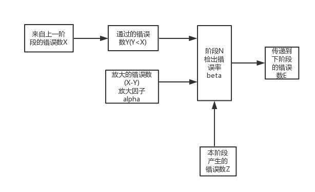

马上要靠software reliability了...
祝我好运

# 填空题 

主考**概念**

> 20分 

1. 可靠性**概念** (P17)：在规定的**条件**下和规定的**时间**内，软件不引起**系统失效**的概率。该概率是系统输入和系统使用的函数，也是软件中固有错误的函数。或者是：规定时间内规定条件下，软件执行规定**功能**的能力。

   规定的**条件**：软件所处的**环境条件**、**负荷大小**与**运行方式**。

   规定的**时间**： 软件测试和运行中主要使用**日历时间**、**时钟时间**、**执行时间**，即所谓cpu时间三种度量。其中**cpu时间**是软件可靠性度量的最佳选择。

   规定的**功能**：为提供给定的服务，软件所必须具备的功能。

   软件可靠性概率$$R$$：表示软件可靠度。$$E$$表示规定的条件，$$t$$表示规定的时间，$$\xi$$ 表示软件从运行开始到失效所经历的时间，
      则$$R(E,t) = P(\xi > t| E)$$ 

2. 可靠性要求 (P159)

   > 哪几类 区别有哪些

   * 定性要求：采用非量化的形式来设计、评价和保证软件的可靠性
   * 定量要求：规定软件的可靠性参数、指标和评估、验证方法，用定量方法组织实施软件的可靠性设计、分析、测试、验证和管理。

3. 可靠性分析~~(配？)~~ (P174)

   > 方法 考两个

   故障树分析、软件失效模式与影响分析、软件潜藏分析、Petri网分析

   ~~等值分配法、相似程序法、相似模块法.........~~

4. 软件可靠性因素  有哪些 

   > 因素 影响 大小

   **软件特性**、**人的因素**和**软件工程管理**是影响软件可靠性的主要因素。这些因素具体分为：

   * 软件的可理解性、软件定义的严密性、软件的复杂性以及软件工程管理、软件测试与排错、人的因素、环境因素软件可靠性工程技术的研究水平与应用能力

5. 软件可靠性设计 (P177)

   > 分类， 方法

   * 基本方法：**避错设计**（只能达到一定的限度）
   * 专门的方法：**查错设计**、**纠错设计**、**容错设计**

6. 7.故障树分析 （P245）

   > 概念，基本元素，主要作用，最小割集求解方法，底事件，顶事件，中间事件，故障树简化方法

   * 故障树概念：是用以表明产品中某些组成部分的故障模式、外界事件及组合将导致产品发生给定故障模式的逻辑图，即不同故障组合的图形模型，这些故障可能产生预先定义的不期望事件。

   * 故障树分析：是通过对可能造成产品故障的硬件、软件、环境、人为因素进行 分析，画出故障树原因的各种组合方式和（或）其发生概率的一种分析法。

   * 最小割集求解方法：下行法，上行法

# 选择题

1. 计算

   > 包括计算-  有关可靠性、可靠度、平均失效时间、平均失效时间间隔、失效率、

2. 关于故障树的计算

   > 顶事件的重要度、最小割集的阶数？

3. 故障率的计算

4. 可靠性测试的概念：目的、分类、作用(P284)

   > 软件可靠性测试不仅是为了发现并排除软件缺陷，促进软件可靠性的增长，而且通过测试来预计和评估软件的可靠性。

   > 分类：可靠性增长测试、可靠性验证测试

   > ???

5. 软件可靠性设计中，可靠性要求的指标的考察(P183)

   > 影响建立软件可靠性指标的因素包括：

   * 分配需求或相关标准中明确给定的可靠性要求
   * 老版本或相似软件的可靠性及用户满意度
   * 其他特征如性能、交付日期、费用等的平衡关系
   * 质量保证方面的考虑
   * 重用其他软件系统中的高可靠构建的潜力
   * 技能能力和局限

6. 软件可靠性的概念（概率？）：使用可靠性、任务可靠性、基本可靠性

7. 基本可靠性的概念（概率？）

# 简答题

1. （概念）错误的传播机理：软件错误传播机理、？？？

   

   > $$E=[Y+(X-Y) \cdot \alpha+Z]\cdot(1-\beta)$$

2. （计算题）故障率、可靠度、故障率的函数、如何知其一推到另外两个

3. （简答题）可靠性建模过程中哪些假定（功能假定）有哪些特点，如何验证假设

   * 模型与其结构和使用频率无关
   * 错误和失效相互独立，一般不考虑其关联性
   * 所有软件错误具有相同的出现率
   * 与程序设计语言和开发方法无关
   * 测试是完备的，建模与测试环境和测试用例的假设分布无关
   * 错误排除过程中一般不引入新的错误
   * 与输入分布和时间选择无关
   * 模型能得到有效验证
   * 有足够而可信的可靠性数据支持

4. （计算题）可靠性分配（可靠性怎么计算、分配方式、基于重要度、基于时间、会指定一种分配方法、根据给定的串联系统或并联系统计算）（P171）

5. 故障树的计算   ：最小割集的求解方法、顶事件发生概率的计算、故障树的简化方法、概率重要度、关键重要度、？？重要度
